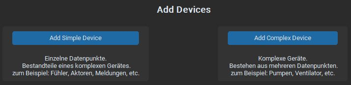

# WinCC Generator Introduction

The **WinCC Generator** is used to generate images in WinCC Unified. The program concept consists of the main program "WinCC Generator," which handles the grouping of data points into devices and message types, and the WinCC Openness interface "WinCC Screen Importer," which creates the generated objects in the TIA Portal.

## Software Support

The current version of the Openness interface is designed for TIA Portal Version 19, though it may also work with TIA V18 (untested).

## Version Control (WinCC Generator)

Version control is managed via GitHub, with the latest version (MainVersion.SubVersion) always available there. The program can be updated to the latest patch directly.

### Versioning Scheme

- **MainVersion**: Indicates significant changes. Upgrading to the latest version is strongly recommended.
- **SubVersion**: It's advisable to update, though you may continue using the software if no issues arise.
- **Patch**: Describes ongoing changes in the program's device database. Can be updated within the program itself.

If issues arise with the current program, check for a newer version before submitting a patch request.

## Functionality Overview

Before using this software, create the symbols for all data points according to the new Geha Symbol Standard via the GLT-Generator. Once done, use the `DBGen_Export` function in the GLT-Generator to generate an Excel file, which will be imported by WinCC Generator.

1. Verify that all necessary symbolic identifiers are present in the WinCC Generator (more information in the "WinCC Generator Functions" section).
2. Set an export path in the settings and start the export.
3. After the export, check the path for an Excel file containing all generated room files and possibly an error file. Read the error file, as it may contain crucial information regarding the export's success.
4. If the export is satisfactory, transfer the Excel file and the WinCC Screen Importer to the VM containing the TIA project, then start the import by opening the WinCC Screen Importer.
5. Follow the program instructions to ensure a smooth import.
6. The import process may take some time; the program will display the working status. Once completed, the process is finished.

## WinCC Generator Functionalities

The WinCC Generator application offers several functions that allow users to expand the device database. The program is largely modular, with both a local and server-based database.

### User Interface Overview

#### WinCC Generator Frame

This section is located on the far left of the GUI and contains essential functions:

- **Start Generating**: Initiates the export process.
  - **Process**: 
    - Initializes the device database.
    - Queries the DBGen import file.
    - Structures the import into a DataFrame.
    - Filters out invalid entries (empty rows).
    - Groups all reserve data points.
    - Groups data points into the corresponding systems (referred to as rooms in the program).
    - Creates device objects.
    - Identifies the message type of the data points (Device Identifier Stage 1).
    - Assigns corresponding device parameters (Faceplate Type, etc.).
    - Generates an identification string for device grouping.
    - Identifies groupable devices (Device Identifier Stage 2).
    - Groups individual data points into complex devices (e.g., pumps).
    - Higher-level groupings may follow in future versions.
    - Stores grouped devices in a DataFrame.
    - Outputs an Excel file formatted for the Openness interface.
    - The systems are represented as worksheets in the Excel file.
    - Export completed.
    
- **Status Display**: Shows the program status (Ready, Running, Done).
- **GitHub**: Links to the GitHub repository containing all program information.
- **Login**: Required for making changes to the server-based database.
- **Close**: Closes the program.
- **Appearance Mode**: Display settings.
- **Update**: Checks the program version status and updates the patch version.
- **User**: Displays the current user after login.
- **Version Status**: Provides information on the version being used and its update status (internet connection required).

#### Interactions Frame

**Device Settings**

Allows users to make changes to the program database.

- **View Devices**: View all devices in the database.
- **Add Devices**: Add new devices locally or on the server.
- **Edit Devices**: Edit or delete existing devices or create new ones if identifiers are changed.
- **Merge Local / Online Devices**: Merge the local device database with the server-based one.

**Basic Functions**

- **Settings**: Configure various settings (Export Path, Local Device Tree).
- **Clear Window**: Resets the Multi Usage Frame to default; used as a back button.

#### Multi Usage Frame

This area of the GUI is used for various displays.

### Detailed Descriptions

#### Add Devices

1. **Choose Device Type**:
    - **Add Message Type**: Consists of a data point (MT, MD, etc.).
    - **Add Device**: The source of the message, consisting of multiple data points (group device, e.g., PU, VE, etc.).

2. **Adding a Complex Device (Example)**:
    - **Symbol Identifier**: Used in Identifier Stage 2 to group related devices.
    - **Comment Identifier**: Optional; if not used, enter "default". It can be used to subdivide device groups (e.g., Pump) into subdevices (e.g., Circulation Pump).
    - **Group Able**: If set to True, the message type (device type) is marked as groupable and undergoes the next higher grouping process.
    - **Device Type**: Assigns the entry in the faceplate's variable interface, usually the same as the Symbol Identifier. 
    - **Faceplate Type**: Type of device from the Geha WinCC Unified library.
    - **Faceplate Version**: If "default" is entered, the latest version is used automatically.
    - **Sub-Objects**: Available only for complex devices, indicating the data points contained within them.
    - **Save and Push**: Saves the device (message type) to the server-based database (current patch version required, and the user must be logged in).
    - **Save Locally**: Saves the device (message type) to the selected local database.

#### Edit Devices

1. **Select Device to Edit**.
2. **Same Entries and Buttons as in Add Devices**.
3. **Save As**: If the Symbol or Comment Identifier is changed and no problematic duplicates are detected, this function acts as a "Save As."
4. **Deleting Devices**: The same conditions apply as for saving processes when deleting devices from the server database.

#### Merge Local/Online Devices

1. **Select Devices (Message Types)** to transfer from the local database to the server-based one.
2. **Follow the Program Instructions**.

#### Settings

1. **Export**:
    - **Default Path**: Resets the export path to the default (installation location, Exports folder).
    - **Set Path**: Allows setting an export location for all generated files; a folder structure is created at the chosen path if it does not exist.
  
2. **Local Device Trees**:
    - The program allows storing and selecting multiple local device databases.
    - **Pull Folder from GitHub**: Load the local database stored on GitHub.
    - **Push Folder to GitHub**: Save the currently used local device tree folder to GitHub (Note: Unsaved changes will be pushed if the folder is not selected and saved before the process).
    - **Import from Local Folder**: Load the device trees from a folder on your computer.
    - **Save to Local Folder**: Save the currently loaded device trees to your computer (Note: Same conditions apply as for Push Folder).
    - **Select Device Trees**: Must always select local device trees for the generation process, even if they are empty!
    - **Discard Changes**: Discards all changes made.
    - **Apply Changes**: Applies and saves all changes made.
